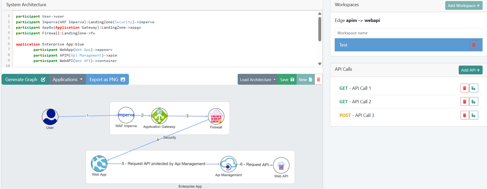

<!-- @format -->

# 🧠 Graphitect

**Graphitect** is a full-stack application for visually generating and managing graph-based representations of APIs and their interactions. It enables teams to model complex systems, document API relationships, and generate dynamic inventories of API calls — all in one intuitive UI.

## 🚀 Features

- ✨ **Graph Generator**

Build and visualize custom graphs with nodes and edges via an interactive editor or code.

- 📘 **API Inventory**

Automatically document and organize API endpoints used across your architecture.

- ⚙️ **Code → Graph**

Define nodes and edges programmatically and see them rendered in real-time.

- 🧾 **Metadata**

Maintain structured data about APIs: methods, endpoints, dependencies, etc.

## 🖼️ UI Preview



## 📦 Installation

### 1. Clone the repo

```bash
git clone  https://github.com/your-username/graphitect.git
cd graphitect
```

### 2. Frontend

```bash
cd client
npm install
npm run start
```

### 3. Backend

```bash
cd server
npm install
npm run dev
```
